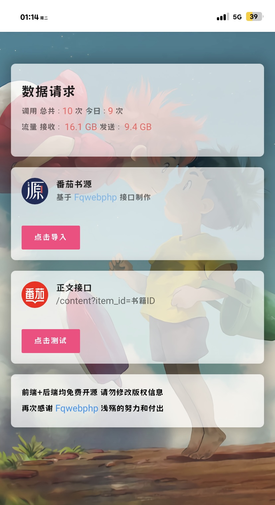

### 使用教程
PHP5.6 删除禁用shell_exe函数 对应版本Redis 基于番茄web服务而集成的PHP网络API接口,需要SVIP账号

先登录后台设置信息完毕即可正常使用,后台:域名/admin  默认账号密码 admin 已提供配套书源

源码仅供测试使用,下载后请于24小时内删除,请勿违反法律使用,本人概不负责!

###  伪静态
`location / {
    rewrite ^/(content|admin|key|login)$ /$1.php last;
}`

### 主要功能
手搓后端,缓存功能,KEY功能,邮箱注册KEY,日请求限制,KEY限制一小时不同IP数量,其他功能待定

### 预览截图

